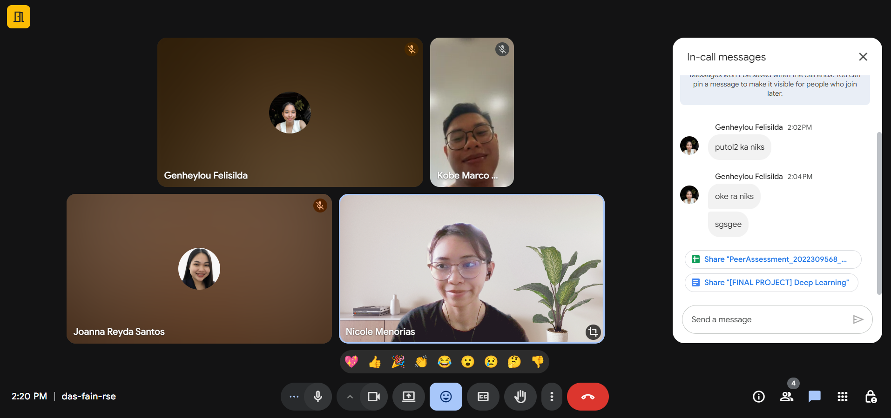

# Week 1 

Nov 10–16 - Narrative Report 

As of November 15, 2025, we had a gmeet to finalize our background of the study and our objectives. Before that, each of us shared our own ideas for what the objectives could be. Our dataset is focused on pulmonary audios, specifically the ICBHI 2017 Respiratory Sound Database. It has 6,898 respiratory cycles labeled as normal, crackle, wheeze, or both crackle and wheeze.

Our study is centered on unstructured datasets, like sound, which are still not widely explored in medicine. We made sure the dataset was reliable before committing to this topic and also built a clear rationale for why this problem is worth looking into. My role in the team was to explore and identify the common challenges in traditional auscultation, such as how subtle lung sounds can be hard to detect, how human error can affect interpretation, and how results can vary between different practitioners.

As a team, we talked about how to handle the dataset and set our main goals, which include improving feature extraction, comparing different models, and experimenting with hyperparameters. Right now, we’re a bit stuck deciding which models to experiment with first, especially since time for running tests is limited.
